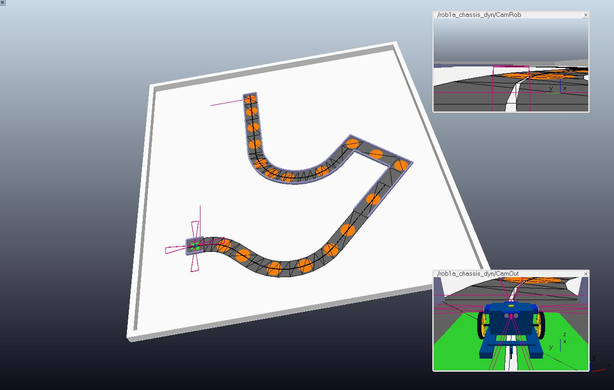

# Boucle Capteur Actionneur ENSTA Bretagne 1A

## Objectif

Décrire le comportement d'un robot roulant pour réaliser des circuit en simulation V-REP (CoppeliaSim).

Le but étant de résoudre de manière autonome le circuit le plus vite possible.

## Le robot

- contrôle différentiel de 2 roues motrices
- perception du monde par 4 sonars, une caméra RGB frontale, une boussole et 3 capteurs de ligne blanche

## Les circuits

- sections rectiligne ou courbe
- section avec ligne blanche au sol ou entourée de murs

